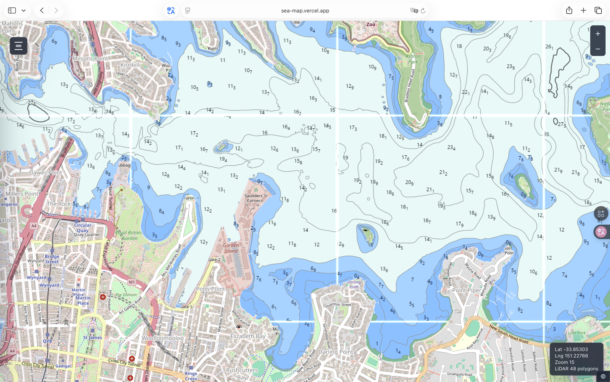
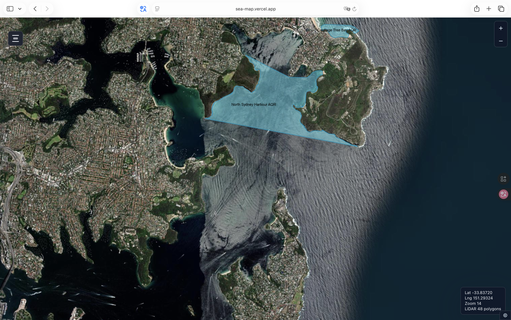
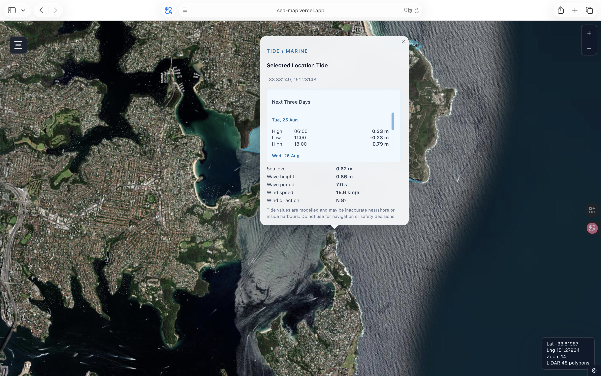
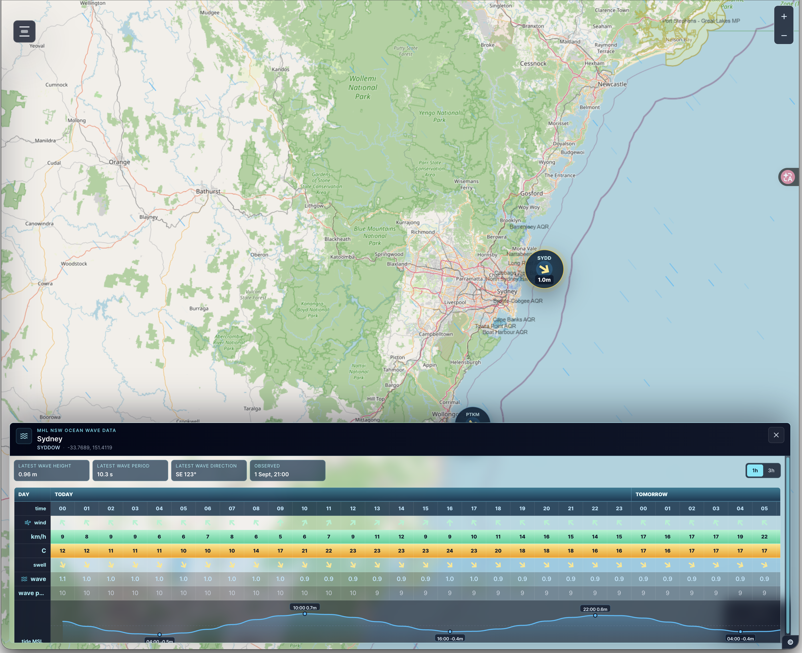

# Australian Marine Bathymetry Web App

A modern React, Tailwind CSS and Leaflet web map for visualising Australian marine bathymetry, NSW coastal LiDAR coverage, marine protected areas, and tide / marine conditions.

Vercel website address: https://sea-map.vercel.app/

## Screenshots

### Bathymetry DEM


### Isobaths at 5m Depth Intervals


### AHO Chart Explorer



### Marine Protected Area



### Tide / Marine Prompt



### Satellite Map


### NSW Coastal and Marine Environmental




## Features

- Street / terrain and high-resolution satellite base maps.
- NSW SEED bathymetry layers:
  - Isobaths at 5m depth intervals
  - Slope - degrees
  - Bathymetry DEM - metres
- AusSeabed national bathymetry raster for non-NSW regions.
- CAPAD marine protected areas by Australian state / territory.
- Marine protected area click query with fishing restriction summary.
- NSW Coastal LiDAR coverage polygons.
- Tide / marine conditions panel:
  - Sea level
  - Today's high / low tides
  - Next three days of high / low tides
  - Wave height
  - Wave period
  - Wind speed
  - Wind direction
- Right-click or long-press the map to query tide / marine conditions for a selected location.
- Responsive glass-style control panel for desktop and mobile.

## Tech Stack

- React
- Vite
- Tailwind CSS
- Leaflet
- React Leaflet
- Esri Leaflet
- Lucide React

## Data Sources

This project uses public data and map services:

- OpenStreetMap base map tiles
- Esri World Imagery satellite tiles
- NSW SEED Marine LiDAR Bathymetry Data 2018
- Geoscience Australia / AusSeabed bathymetry WMS
- CAPAD Marine Protected Areas service
- Open-Meteo Marine Weather API
- Open-Meteo Weather Forecast API
- Manly Hydraulics Laboratory NSW Ocean Wave Data Collection Program for latest NSW wave buoy observations

Tide values are modelled and may be inaccurate nearshore or inside harbours. They are provided for visual context only and must not be used for navigation or safety-critical decisions.

## NSW Wave Buoys

The app uses the MHL public API for the latest NSW ocean wave buoy observations where a selected location is close to a buoy. The default buoy set matches the MHL Ocean Wave page: Byron Bay, Coffs Harbour, Crowdy Head, Sydney, Port Kembla, Batemans Bay, and Eden.

When MHL observations are unavailable or the selected location is too far from a buoy, the app falls back to Open-Meteo marine wave values.

## Install

```bash
npm install
```

## Run Locally

```bash
npm start
```

or:

```bash
npm run dev
```

Vite will print a local URL such as:

```text
http://localhost:5173/
```

If that port is already in use, Vite will automatically choose another port.

## Build

```bash
npm run build
```

The production build is generated in:

```text
dist/
```

## Preview Production Build

```bash
npm run preview
```

## GitHub Upload Notes


The original Shapefile directory is large and duplicates the converted GeoJSON used by the app. It is usually better to exclude it:

```gitignore
Marine_NSWCoastalLidarCoverage_20190827/
```

The app currently uses `public/data/nsw-lidar-coverage.geojson`, which is about 27 MB. This can be committed if you want the app to run fully from the repository, but it will make the repo larger.

## Attribution

Keep map and data attribution visible when deploying the app. Review the terms of use for OpenStreetMap, Esri, NSW SEED, AusSeabed, CAPAD, Open-Meteo, and MHL before public production deployment.
